# MacModula2 demo gallery

Native macOS apps written entirely in **Modula-2**, drawn with Core Graphics on an
`NSView` (a Modula-2 `CLASS` *is* an Objective-C object). Every screenshot below
was rendered **headlessly** — each demo snapshots its own view offscreen, no window
server needed — so the gallery regenerates itself.

> Run any of them with:
> `./target/debug/newm2-driver run --library library cocoademos/<name>.mod`
> *(thumbnails link to the full-resolution image)*

---

## Original arcade games

### Tetris
[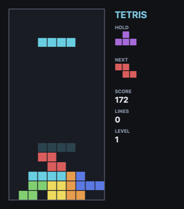](img/tetris.png)

The full game on a flipped Core Graphics cell grid: a **7-bag randomizer**, a
**hold** slot, a **ghost-drop** preview, a **line-clear flash**, scoring/levels, and
synthesized sound effects. Gravity runs on an `NSTimer` block. — `tetris_cocoa.mod`

### Asteroids
[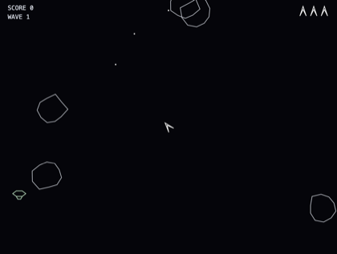](img/asteroids.png)

Classic white **vector graphics** drawn with stroked CG paths: momentum, thrust and
screen-wrap; rocks that split large → medium → small; a **lurking UFO** that fires
aimed bolts; **ship-explosion debris**; and the two-tone background heartbeat. —
`asteroids_cocoa.mod`

### Breakout
[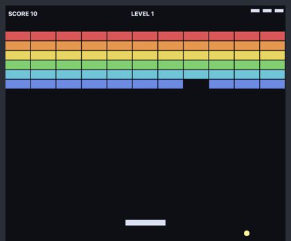](img/breakout.png)

Ball physics off the walls, bricks and paddle — with the bounce **angle set by where
the ball strikes the paddle**, so you steer it. Rainbow brick wall, lives, levels and
bounce/break SFX. — `breakout_cocoa.mod`

### Star Turret
[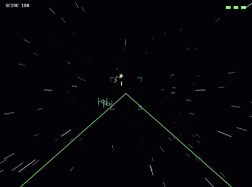](img/starturret.png)

A first-person **3-D warp gun-turret**: a perspective-projected vector starfield
streaking past, enemy fighters that **loom larger as they close** (and burst into
flying shrapnel when shot), and asterisk bolts you steer to dodge. —
`starturret_cocoa.mod`

---

## Instruments & tools

### Synth Lab
[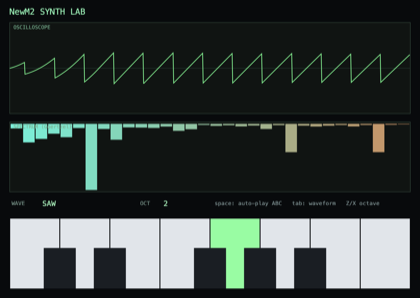](img/synth.png)

A software synthesizer: each note is rendered by the pure-Modula-2 `Audio` engine,
and the **same PCM samples** are drawn two ways — a live **oscilloscope** and a
hand-rolled **Goertzel spectrum** (a sine shows one peak, a sawtooth a comb of
harmonics). Playable keyboard, six waveforms, and ABC-tune auto-play. —
`synth_cocoa.mod`

### Terminal (TUI)
[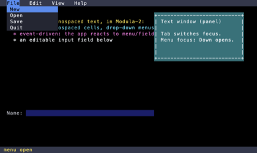](img/term_demo.png)

A text user interface rendered as a grid of colored character cells: a menu bar with
drop-down menus, a boxed text panel, an editable input field and a status bar — all
event-driven. — `term_demo_cocoa.mod`

### Calculator
[](img/calculator.png)

A scientific calculator with native AppKit buttons and a hand-written
**recursive-descent expression evaluator** (precedence, `^`, unary minus, parens,
`sin/cos/tan/ln/log/sqrt/exp`, `pi`/`e`). — `calculator_cocoa.mod`

### Business Dashboard
[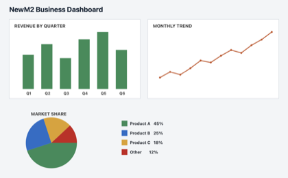](img/chart.png)

A bar chart, line chart, pie chart (Core Graphics arcs) and a legend, with NSString
text labels — a static dashboard drawn entirely in Modula-2. — `chart_cocoa.mod`

---

## Simulations & graphics

### SIMD Particles
[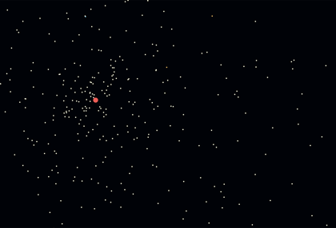](img/simd_particles.png)

640 particles pulled toward a moving attractor, integrated **four at a time in
`REAL32X4` lane vectors** (first-class SIMD); speed-colored and drawn as CG discs. —
`simd_particles_cocoa.mod`

### Worms
[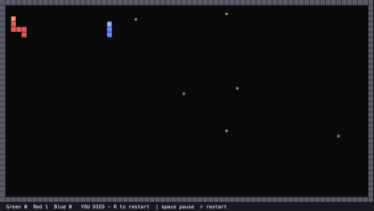](img/worms.png)

A multi-worm game where **three worker `COROUTINE`s** — the red and blue worm AIs and
a treat dispenser — cooperate with the main loop, on a Core Graphics text grid. —
`worms_cocoa.mod`

### Conway's Game of Life
[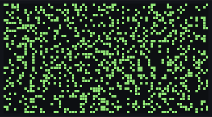](img/life.png)

The B3/S23 rule on a torus, stepped by an `NSTimer` block; the grid is a Modula-2
`CLASS` that *is* an `NSView`. — `life_cocoa.mod`

### Mandelbrot
[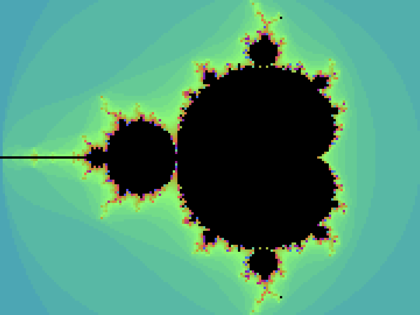](img/mandelbrot.png)

The CPU escape-time set in colour over Core Graphics; arrows pan, `+`/`-` zoom. —
`mandelbrot_cocoa.mod`

### Minesweeper
[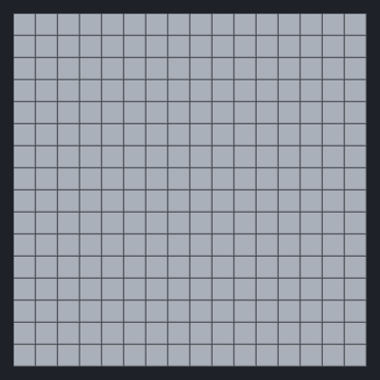](img/minesweeper.png)

Mouse-driven Minesweeper on a CG cell grid: left-click reveals (recursive flood-fill
of empty regions), right-click flags; the first click is always safe. —
`minesweeper_cocoa.mod`

### Reversi / Othello
[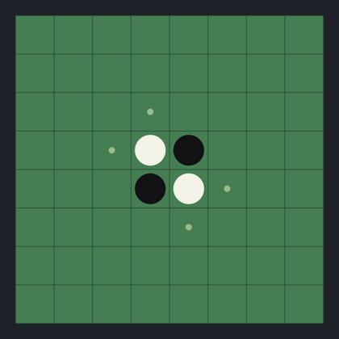](img/reversi.png)

A green-felt board with anti-aliased discs and faint legal-move hints; you play Black
against a greedy corner-preferring AI. — `reversi_cocoa.mod`

---

## The IDE

### MacM2 IDE
[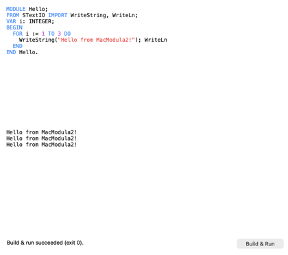](img/ide.png)

A native Cocoa Modula-2 IDE: a **syntax-highlighted editor**, an output pane and a
status line, plus a **Build & Run** button whose Modula-2 action reads the editor
buffer, runs the compiler as a subprocess, and shows the captured output. —
`projects/macide/macos_ide.mod` (skeleton) · `macos_panes_ide.mod` (full panes IDE)

---

## Also in `cocoademos/` — GPU / Metal demos

These render through **Metal** (the offscreen snapshot path can't capture a Metal
layer), so they aren't pictured here — run them to see them live:

`mandelbrot_gpu` · `julia` · `plasma` · `raymarch` · `metaballs` · `metalpane` ·
`metalsprites` · `tunnel` · `glimmer` · `galaxigans`

```
./target/debug/newm2-driver run --library library cocoademos/raymarch.mod
```
