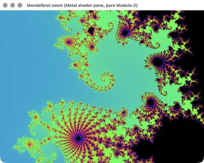
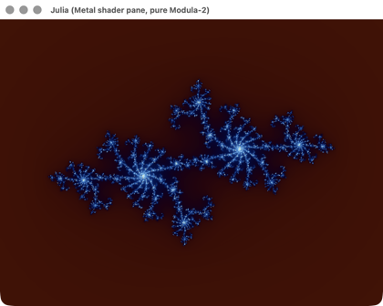
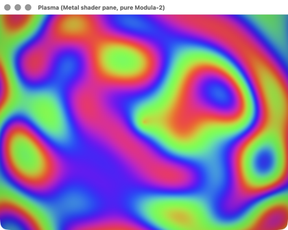
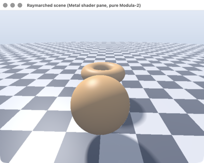
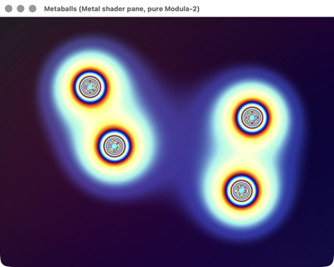
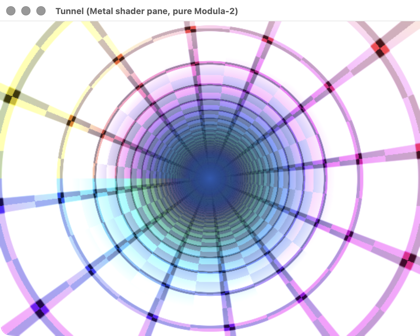
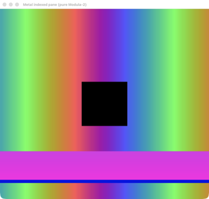
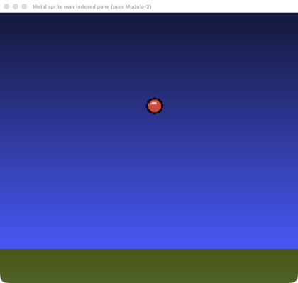
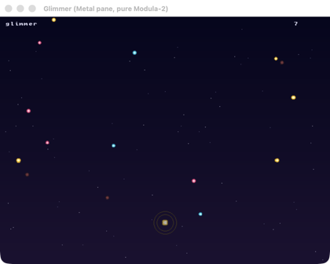
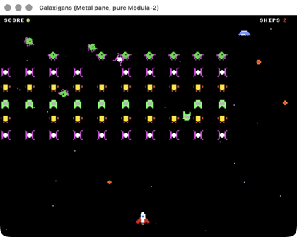

# MacModula2 demo gallery

Native macOS apps written entirely in **Modula-2** — a Modula-2 `CLASS` *is* an
Objective-C object. The **Core Graphics / AppKit** demos draw into an `NSView` and
were captured **headlessly**: each snapshots its own view offscreen, no window server
needed. The **GPU** demos render through **Metal** (which can't be snapshotted
offscreen), so those were captured live from the window server — title bars and all.

> Run any of them with:
> `./target/debug/newm2-driver run --library library cocoademos/<name>.mod`
> *(thumbnails link to the full-resolution image)*

---

## Original arcade games

### Tetris

The full game on a flipped Core Graphics cell grid: a **7-bag randomizer**, a
**hold** slot, a **ghost-drop** preview, a **line-clear flash**, scoring/levels, and
synthesized sound effects. Gravity runs on an `NSTimer` block. — `tetris_cocoa.mod`

### Asteroids

Classic white **vector graphics** drawn with stroked CG paths: momentum, thrust and
screen-wrap; rocks that split large → medium → small; a **lurking UFO** that fires
aimed bolts; **ship-explosion debris**; and the two-tone background heartbeat. —
`asteroids_cocoa.mod`

### Breakout

Ball physics off the walls, bricks and paddle — with the bounce **angle set by where
the ball strikes the paddle**, so you steer it. Rainbow brick wall, lives, levels and
bounce/break SFX. — `breakout_cocoa.mod`

### Star Turret

A first-person **3-D warp gun-turret**: a perspective-projected vector starfield
streaking past, enemy fighters that **loom larger as they close** (and burst into
flying shrapnel when shot), and asterisk bolts you steer to dodge. —
`starturret_cocoa.mod`

---

## Instruments & tools

### Synth Lab

A software synthesizer: each note is rendered by the pure-Modula-2 `Audio` engine,
and the **same PCM samples** are drawn two ways — a live **oscilloscope** and a
hand-rolled **Goertzel spectrum** (a sine shows one peak, a sawtooth a comb of
harmonics). Playable keyboard, six waveforms, and ABC-tune auto-play. —
`synth_cocoa.mod`

### Terminal (TUI)

A text user interface rendered as a grid of colored character cells: a menu bar with
drop-down menus, a boxed text panel, an editable input field and a status bar — all
event-driven. — `term_demo_cocoa.mod`

### Calculator

A scientific calculator with native AppKit buttons and a hand-written
**recursive-descent expression evaluator** (precedence, `^`, unary minus, parens,
`sin/cos/tan/ln/log/sqrt/exp`, `pi`/`e`). — `calculator_cocoa.mod`

### Business Dashboard

A bar chart, line chart, pie chart (Core Graphics arcs) and a legend, with NSString
text labels — a static dashboard drawn entirely in Modula-2. — `chart_cocoa.mod`

---

## Simulations & graphics

### SIMD Particles

640 particles pulled toward a moving attractor, integrated **four at a time in
`REAL32X4` lane vectors** (first-class SIMD); speed-colored and drawn as CG discs. —
`simd_particles_cocoa.mod`

### Worms

A multi-worm game where **three worker `COROUTINE`s** — the red and blue worm AIs and
a treat dispenser — cooperate with the main loop, on a Core Graphics text grid. —
`worms_cocoa.mod`

### Conway's Game of Life

The B3/S23 rule on a torus, stepped by an `NSTimer` block; the grid is a Modula-2
`CLASS` that *is* an `NSView`. — `life_cocoa.mod`

### Mandelbrot

The CPU escape-time set in colour over Core Graphics; arrows pan, `+`/`-` zoom. —
`mandelbrot_cocoa.mod`

### Minesweeper

Mouse-driven Minesweeper on a CG cell grid: left-click reveals (recursive flood-fill
of empty regions), right-click flags; the first click is always safe. —
`minesweeper_cocoa.mod`

### Reversi / Othello

A green-felt board with anti-aliased discs and faint legal-move hints; you play Black
against a greedy corner-preferring AI. — `reversi_cocoa.mod`

---

## The IDE

### MacM2 IDE

A native Cocoa Modula-2 IDE: a **syntax-highlighted editor**, an output pane and a
status line, plus a **Build & Run** button whose Modula-2 action reads the editor
buffer, runs the compiler as a subprocess, and shows the captured output. —
`projects/macide/macos_ide.mod` (skeleton) · `macos_panes_ide.mod` (full panes IDE)

---

## GPU / Metal — fragment-shader panes

Each of these hands a Metal Shading Language fragment shader to a `ShaderPane` host,
which compiles it at runtime and streams per-frame uniforms; the GPU then evaluates
the effect per pixel (often with an empty Modula-2 `Tick` — all the motion is `u.time`).

### Mandelbrot (GPU)

A runtime-compiled fragment shader iterates *z = z² + c* per pixel with smooth
log-escape colouring, while pure Modula-2 drives an endless auto-dive toward a spiral,
deepening the iteration cap as it descends. Arrow-keys pan, `+`/`-` zoom. —
`mandelbrot_gpu.mod`

### Julia Set (GPU)

The same *z = z² + c* escape-time loop on the GPU, but the constant `c` sweeps a
radius-0.7885 circle so the dendritic fractal morphs continuously; smooth-iteration
counts drive a cosine palette. — `julia.mod`

### Plasma

A fragment shader sums several drifting sine waves per pixel into a scalar, then maps
it through a time-drifting cosine palette — the classic flowing red/magenta/blue/green
blobs, finished with a soft vignette. The M2 `Tick` is empty; every frame is the GPU's.
— `plasma.mod`

### Raymarched Scene

A shader sphere-traces a signed-distance field per pixel: a checkered ground plane
plus a bobbing sphere `smin`-blended with a torus, lit with marched soft shadows,
specular, distance fog and gamma. The camera orbits entirely from `u.time`. —
`raymarch.mod`

### Metaballs

Four drifting charge points are summed as inverse-square distance fields and
thresholded with `smoothstep`, so the glowing blobs fuse and split in real time;
iridescent ringed cores and the violet field are all coloured on the GPU. —
`metaballs.mod`

### Tunnel

A single fragment shader warps screen space into polar coordinates, scrolling a radial
checkerboard down an infinite tunnel with a cosine palette and an exponential
centre-glow at the vanishing point. — `tunnel.mod`

---

## GPU / Metal — indexed-colour panes & sprites

A retro twist: a 256×240 **index buffer** plus a split palette are uploaded as
`MTLBuffer`s and resolved on the GPU by a Metal shader — a hardware-accelerated
"VRAM + CLUT", composited with sprite quads, all from pure Modula-2 over the
`objc_msgSend` bridge.

### Metal Pane

The building block: a 256×240 index buffer with a split palette (16 per-line colours
per scanline + 240 global entries), resolved on the GPU by a runtime-compiled shader.
The frame shows the global-palette rainbow, an index-0 transparent square over the
black clear, and a per-line gradient band — no Rust or Obj-C, just the bridge and one
C entry point. — `metalpane.mod`

### Metal Sprites

A bouncing 16-colour ball sprite composited on the GPU over an indexed-palette dusk
pane; an `NSTimer` uploads only the sprite's position. Two Metal pipelines do it — one
resolves the background's per-scanline palette, the other draws the sprite quad with
index 0 discarded for transparency. — `metalsprites.mod`

### Glimmer

A firefly tends its glow across a drifting night sky, chasing soft cyan/gold/rose motes
and dodging embers: a per-scanline gradient sky, twinkling palette-indexed stars,
scaled & rotated alpha-blended sprites and the firefly's swelling halo. Bell and drone
cues are synthesized via ABC → SMF → `AVMIDIPlayer`. — `glimmer.mod`

### Galaxigans

A swarming-formation space shooter on the indexed sprite pane: dozens of
palette-defined pixel-art aliens, a diving-bomber AI, a bonus saucer and a parallax
starfield, all composited on the GPU each frame. It drives the native game loop and
input directly, firing live synthesized SFX and non-blocking ABC-authored MIDI. —
`galaxigans.mod`
